# 📘 Практичне заняття №1  
**Студент:** _Погоня Андрій_
**Група:** _ІПЗ-3.03_
## Проходження інтерактивного курсу «Git How To»

**Посилання на курс:** [https://githowto.com/uk](https://githowto.com/uk)

---

## 🎯 Мета роботи

Ознайомитися з базовими командами та принципами роботи з системою контролю версій **Git** шляхом проходження інтерактивного навчального курсу **«Git How To»**.  
Сформувати практичні навички використання Git у консольному середовищі для виконання основних операцій з репозиторієм.

---

## 📍 Частина 1. Основи Git:

### 1. **Фінальні приготування** — налаштування середовища для роботи з Git, перевірка встановлення та конфігурація користувача через `git config`.
 

  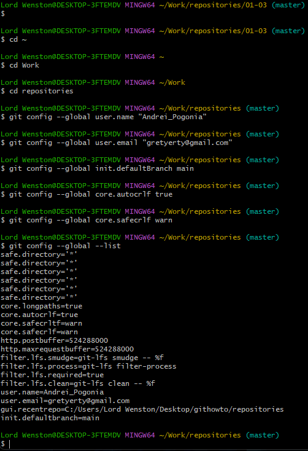
 

### 2. **Створення проєкту** — створення нового каталогу та ініціалізація репозиторію командою `git init`.

 

  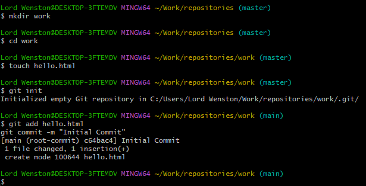
 

 
### 3. **Перевірка стану** — використання `git status` для перегляду стану робочого каталогу.

 

  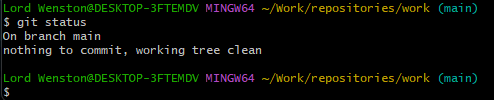
 

### 4. **Внесення змін** — редагування файлів та спостереження за змінами у `git status`.

 

  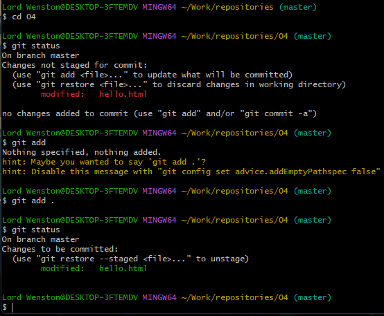
 

### 5. **Індексація змін** — додавання файлів у staging area за допомогою `git add`.  

 

  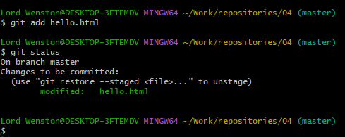
 

### 6. **Індексація та коміт** — створення першого коміту `git commit -m "Initial commit"`. 

 

  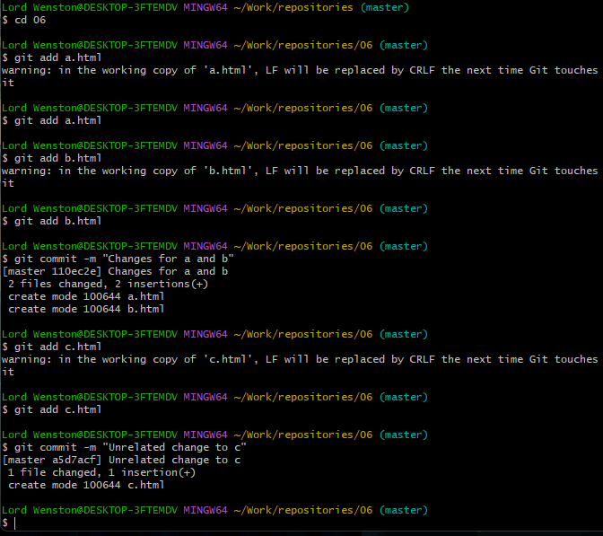
 

### 7. **Коміт змін** — коміти наступних оновлень із зрозумілими повідомленнями.

 

    
 

 

    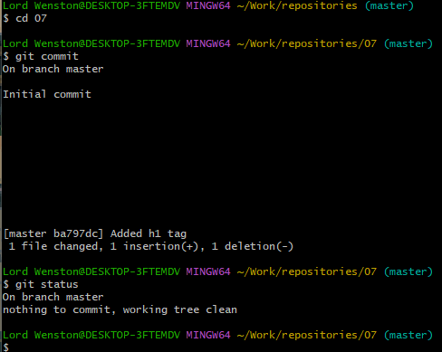
 

### 8. **Зміни, а не файли** — розуміння того, що Git відстежує зміни, а не просто файли.  

 

    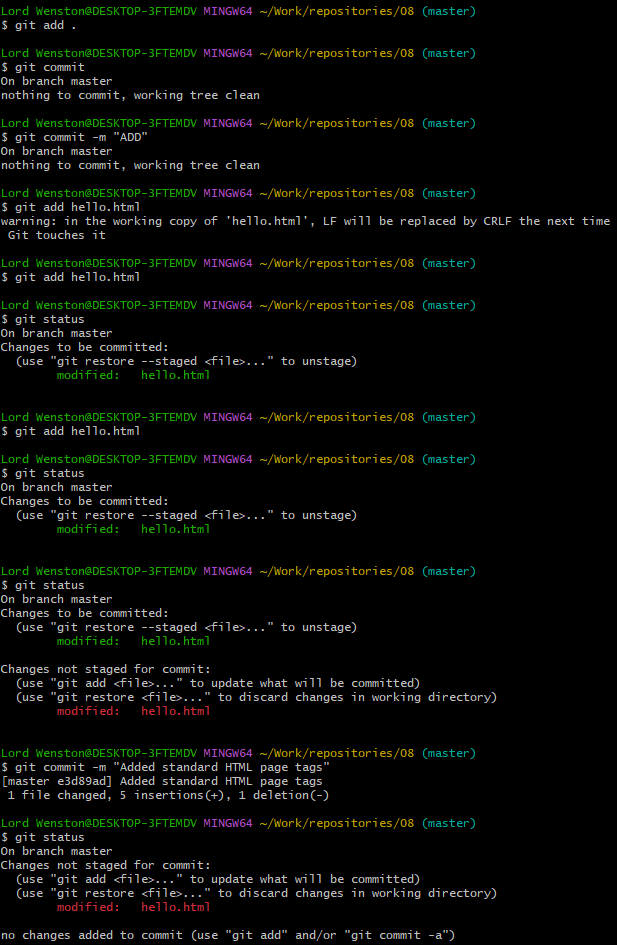
 

 

    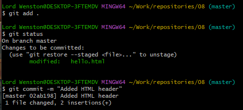
 

### 9. **Історія проєкту** — перегляд історії комітів командою `git log`.  

 

    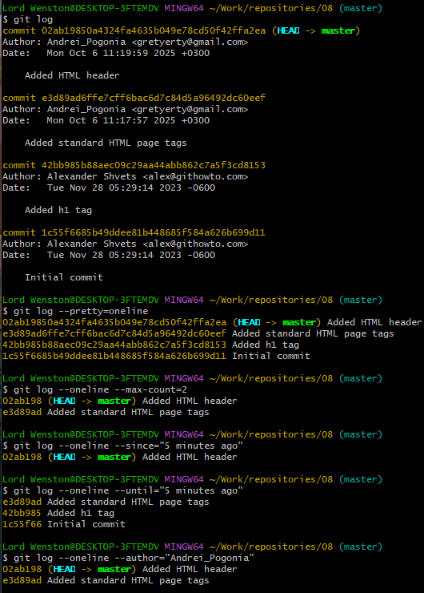
 

 

    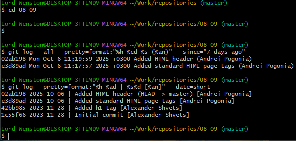
 

 
 

    
 

### 10. **Отримання старих версій** — використання `git checkout <commit>` для переходу до попередніх версій файлів.  

 

  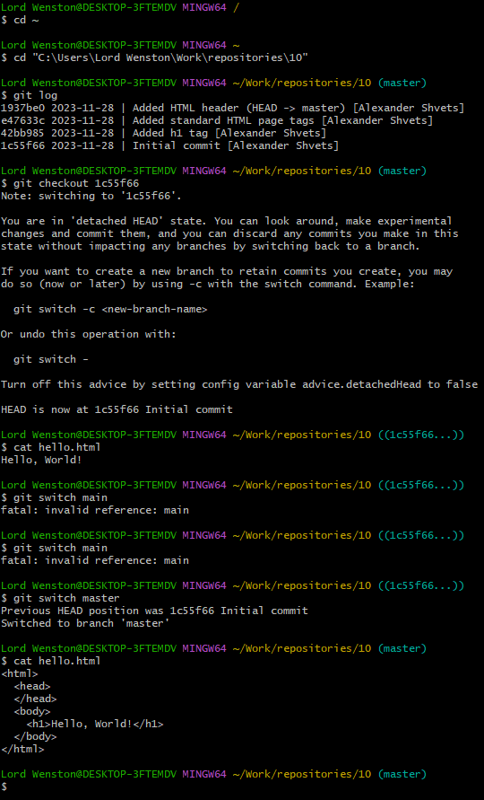
 

### 11. **Створення тегів версій** — позначення важливих станів проєкту через `git tag`.

 

    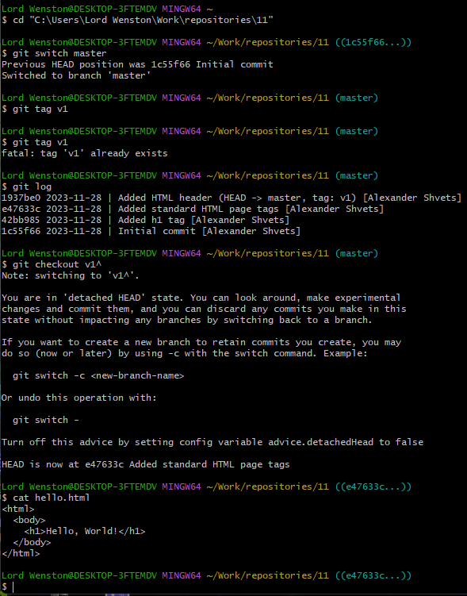
 

 

    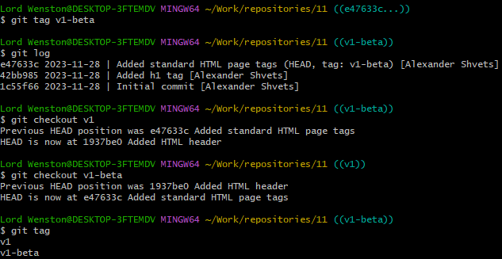
 

 
 

    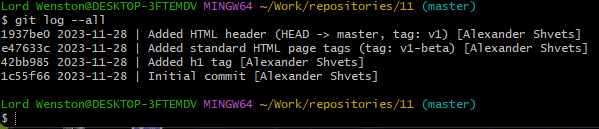
 

### 12. **Скасування локальних змін (до індексації)** — повернення файлу до останнього коміту через `git checkout -- <file>`.

 

  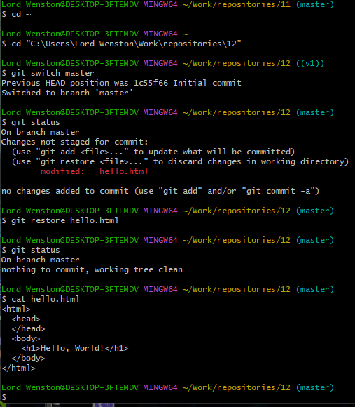
 

### 13. **Скасування проіндексованих змін (перед комітом)** — видалення зі staging area через `git reset HEAD <file>`.

 

  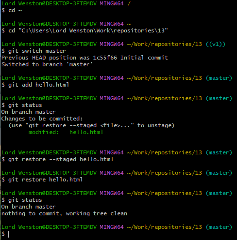
 

### 14. **Скасування комітів** — повернення до попередніх комітів за допомогою `git reset`.

 

    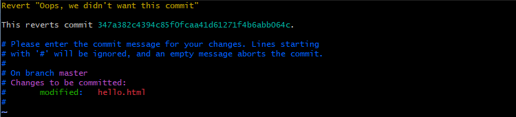
 

 

    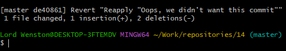
 

 
 

    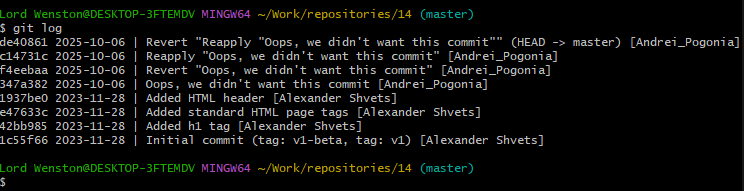
 

### 15. **Видалення комітів з гілки (revert)** — створення нового коміту, який скасовує зміни попереднього (`git revert`).

 

  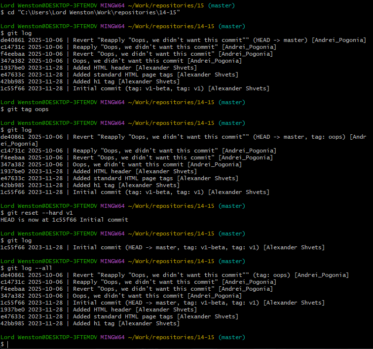
 

### 16. **Видалення тегу oops** — видалення некоректного тегу командою `git tag -d oops`.

 

  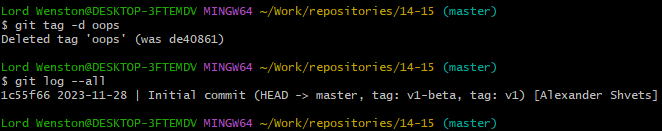
 

### 17. **Внесення змін до комітів** — редагування останнього коміту за допомогою `git commit --amend`.

 

  
 

### 18. **Створення гілки** — створення нової гілки командою `git branch <branch_name>`. 

 

  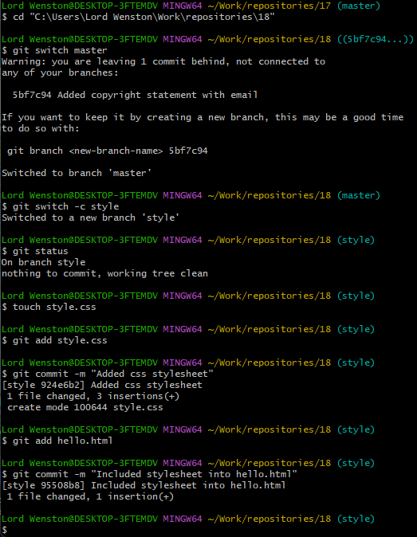
 

### 19. **Перемикання гілок** — перехід між гілками через `git checkout <branch_name>`. 

 

  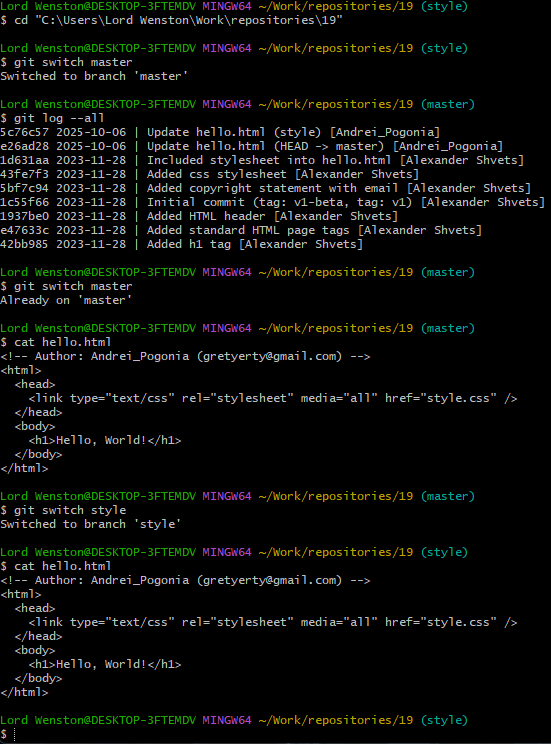
 

### 20. **Переміщення файлів** — перейменування або переміщення файлів за допомогою `git mv`.

 

    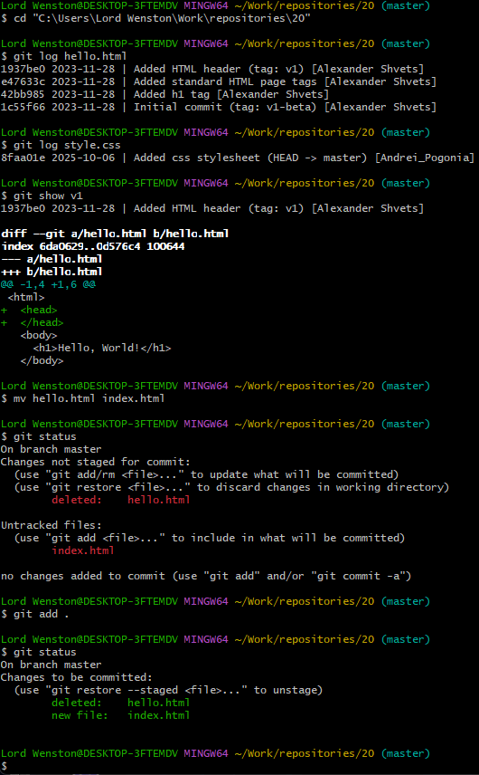
 

 

    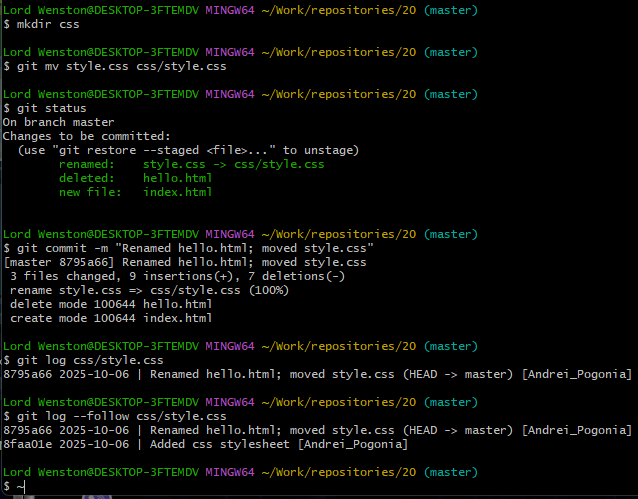
 

### 21. **Зміни в гілці main** — внесення нових змін безпосередньо у головну гілку.

 

  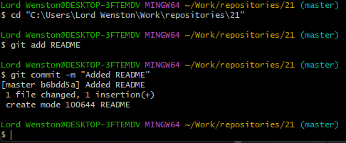
 
  

### 22. **Перегляд розбіжних гілок** — порівняння гілок за допомогою `git diff branch1..branch2`.

 

  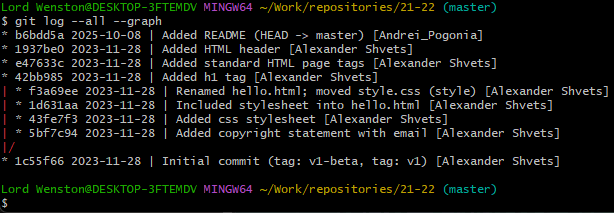
 
  
   
### 23. **Злиття** — об’єднання гілок командою `git merge`.

 

  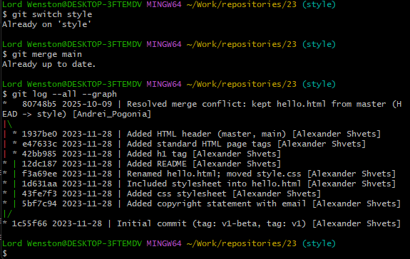
 
  
   
### 24. **Створення конфлікту** — навмисне редагування одного й того ж файлу у двох гілках.

 

  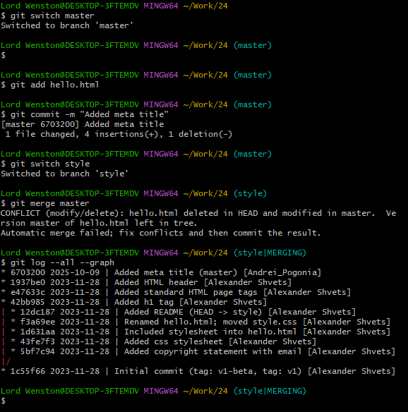
 
 

### 25. **Вирішення конфліктів** — ручне редагування файлів та завершення злиття через `git add` і `git commit`.

 

    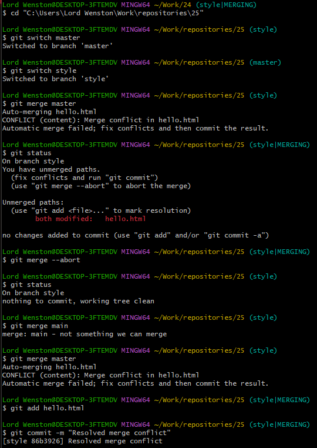
 

 

    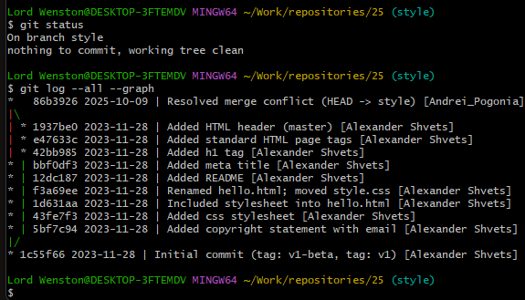
 

### 26. **rebase проти merge** — ознайомлення з різницею між `git rebase` і `git merge`. 
Merge vs Rebase:

- Merge (злиття)
  - Зберігає всі коміти обох гілок.
  - Створює додатковий merge-коміт.
  - Історія розгалужена — видно, де була гілка.
  - Конфлікти вирішуються один раз під час злиття.
  - Використовується, коли важливо зберегти повну історію змін.

- Rebase (перебазування)
  - Переносить коміти однієї гілки поверх іншої, як ніби вони створені після останнього коміту базової гілки.
  - Історія виглядає лінійною, без merge-комітів.
  - Може вимагати вирішення конфліктів для кожного коміту окремо.
  - Використовується, коли хочемо «очистити» історію перед інтеграцією змін.

- Приклад дій:
  - Повернути гілки до стану до merge: Використовують git reset на коміт перед злиттям.

  - Замість merge роблять rebase: Перехід на гілку з новими комітами: git checkout feature, Перебазування на основну гілку: git rebase main, Потім можна злити в main швидким merge (fast-forward) без створення додаткового коміту.
  
### 27. **Відкочування гілки style** — повернення стану гілки `style` до попереднього коміту.

 

  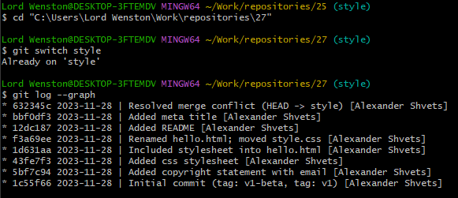
 
 
  
### 28. **Перебазування** — використання `git rebase` для вирівнювання історії.

 

  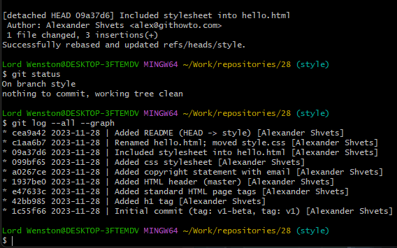
 
 
   
### 29. **Злиття в гілку main** — завершення роботи над фічами шляхом об’єднання всіх змін у головну гілку.

 

  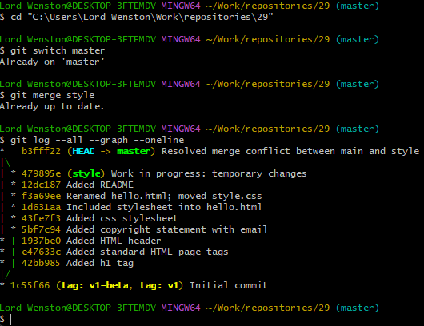
 
 
   

---

## 🌐 Частина 2. Декілька репозиторіїв:

### 30. **Клонування репозиторіїв** — копіювання існуючого репозиторію через `git clone <url>`.

 

  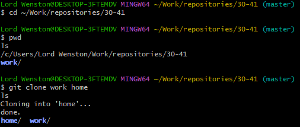
 
 
     
### 31. **Перегляд клонованого репозиторія** — аналіз структури скопійованого репозиторію. 

 

  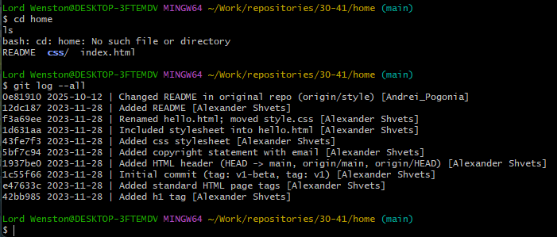
 
 

### 32. **Що таке origin?** — розуміння, що `origin` — це стандартна назва для віддаленого репозиторію.

 

  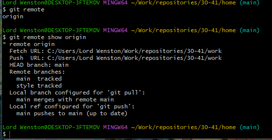
 
 

### 33. **Віддалені гілки** — перегляд гілок, що існують на віддаленому сервері (`git branch -r`). 

 

  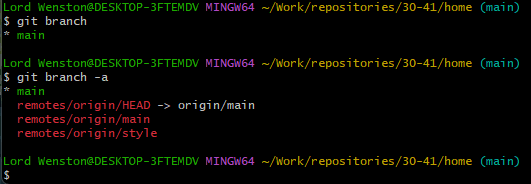
 
 

### 34. **Зміна оригінального репозиторія** — внесення змін до вихідного репозиторію, який клонували.

 

  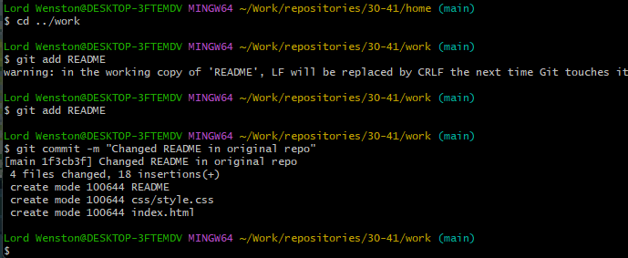
 
 

### 35. **Підтягування змін** — отримання оновлень через `git fetch`.  

 

  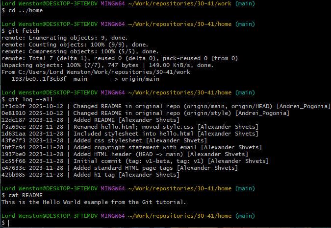
 
 

### 36. **Злиття підтягнутих змін** — об’єднання отриманих оновлень (`git merge origin/main`).

 

    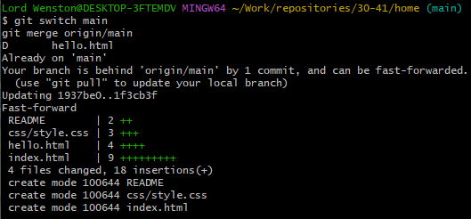
 

 

    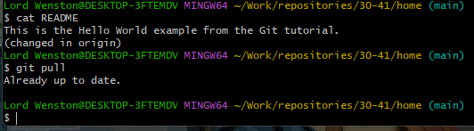
 

 
### 37. **Додавання гілки відстеження** — створення локальної гілки, що відстежує віддалену (`git checkout -b <branch> origin/<branch>`).

 

  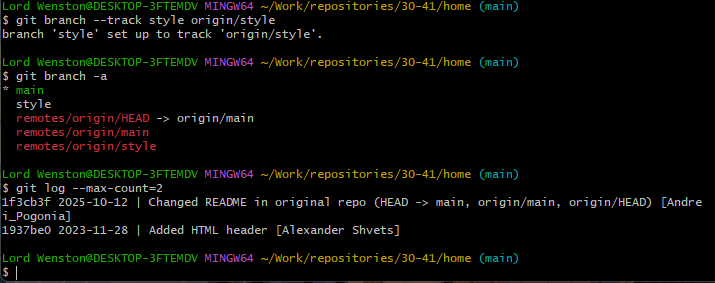
 
 

### 38. **Чисті репозиторії** — створення “bare” репозиторію (`git init --bare`) для спільної роботи.  

 

  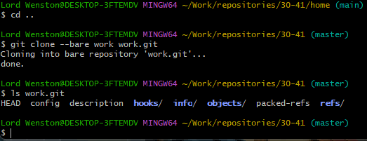
 
 

### 39. **Додавання віддаленого репозиторія** — додавання нового віддаленого джерела командою `git remote add <name> <url>`. 

 

  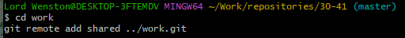
 
 

### 40. **Відправка змін** — публікація локальних комітів на сервер через `git push`.  

 

  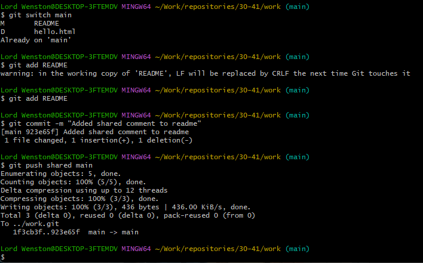
 
 

### 41. **Підтягування спільних змін** — отримання та об’єднання змін з віддаленого репозиторію (`git pull`). 

 

  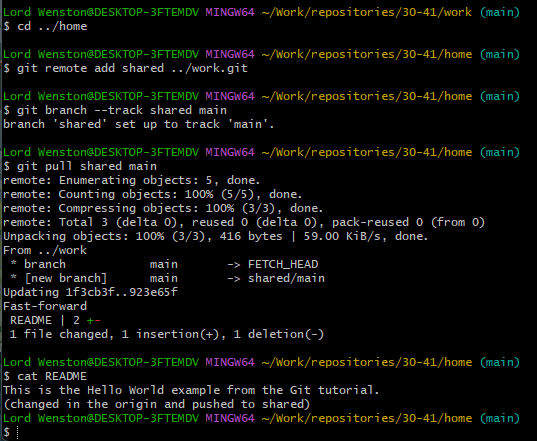
 
 

---

## 🖼️ Доказ виконання

У папці `/images` додано знімки екрана, що підтверджують проходження кожного кроку курсу GitHowTo.

---

## 💬 Висновок

Під час виконання практичного завдання я пройшов **усі 41 етап** інтерактивного курсу **Git How To**, що дало змогу комплексно ознайомитися з принципами роботи системи контролю версій Git.  
У процесі навчання я набув практичних навичок створення та налаштування репозиторіїв, індексації й коміту змін, роботи з гілками, тегами, злиттям, перебазуванням та вирішенням конфліктів.  
Також було вивчено способи взаємодії з віддаленими репозиторіями, виконання операцій `push`, `pull`, `fetch`, `merge`, `rebase`, а також методи організації спільної розробки через платформи GitHub та GitLab.  

Курс продемонстрував важливість використання Git у командній розробці, забезпечення контролю версій, відтворюваності змін і прозорості історії проєкту.  
Завдяки покроковим завданням я навчився швидко орієнтуватися у консольних командах Git, розуміти структуру комітів і гілок, а також ефективно виправляти помилки у процесі розробки.  

Отримані знання стануть основою для подальшого використання Git у реальних програмних проєктах, автоматизації роботи з версіями коду та підтримки колективної розробки в рамках більших систем.

---

